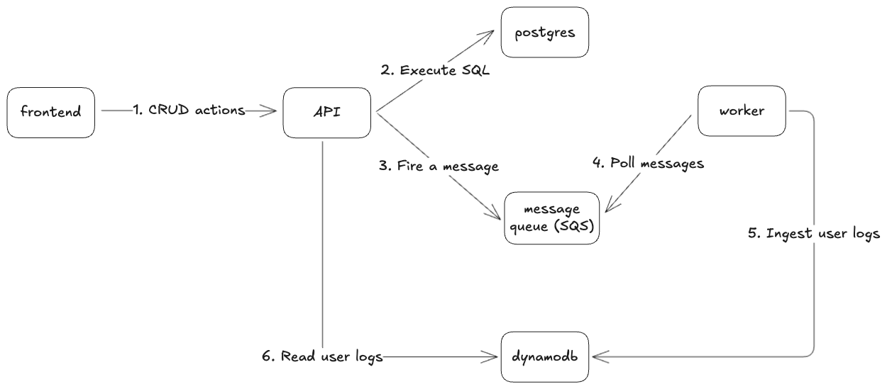

# QaasT Interview

## Assessment
[Managing User Records App](https://doc.clickup.com/3627772/p/h/3epqw-568058/983f09565a115c8/3epqw-568058)

## Design Overview


- The frontend calls the API for every CRUD action (Step 1).
- For CRUD operations on the `users` table, the API executes SQL and sends a message to a queue (Steps 2 and 3).
- A worker polls the queue and ingests the data into DynamoDB as `userlogs` (Steps 4 and 5).
- The admin can read the `userlogs` by calling the admin API (Step 6).

## Project structure

My project follows monorepo structure:
```
.
├── pkg                    # Shared packages
├── tests                  # Integration tests
└── services
    ├── worker             # Background worker
    └── api                # API service
        ├── transport      # Router or event handlers
        ├── service        # Business logic layer
        ├── store          # Database or third party callers
        └── main.go        # Trigger point
```

Note: In this assignment, I mainly focused on the backend code. For the UI, I used ChatGPT to quickly generate interfaces that fit the API endpoints. As a result, the project structure and code of the frontend may not follow best practices.

## Project Startup
1. Navigate to the `be` folder
2. Run `make compose-all`
3. Navigate to the `fe` folder
4. Run `make compose-all`
5. Access the UI at: `localhost:3000`

Please read the README.md in `be` and `fe` folders for more instructions.